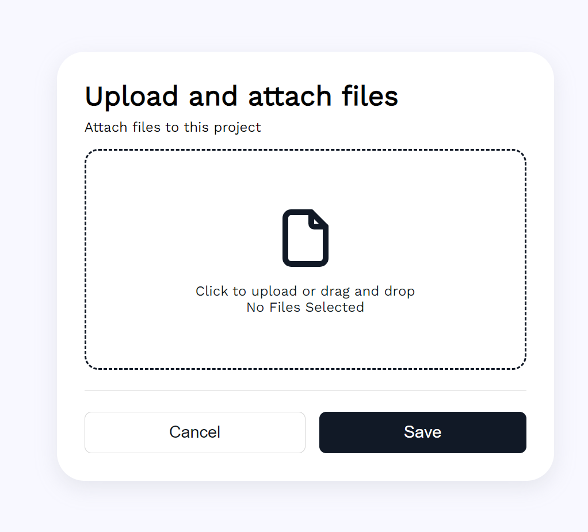

# Vinishireis - DropZone (Vinishireis)

A pen Created on Vinishireis

---
DropZone is a web application created using HTML, CSS, and JavaScript, designed to provide a responsive user experience. The application allows users to easily upload files by simply dragging and dropping them onto the designated area, hence the name "DropZone."

Utilizing HTML, DropZone defines the structure and content of the web page, including the areas where users can drop their files. CSS is employed to style the elements, ensuring a visually appealing and user-friendly interface across different devices and screen sizes.

JavaScript adds interactivity to the application, enabling functionalities such as file handling, validation, and feedback to the user. With JavaScript, DropZone can dynamically update the interface based on user actions, providing real-time responses and enhancing the overall user experience.

Being responsive means that DropZone is designed to adapt seamlessly to various screen sizes and orientations, whether it's accessed on a desktop computer, tablet, or smartphone. This ensures that users can utilize DropZone effectively regardless of the device they are using, making it convenient and accessible across different platforms.
---

